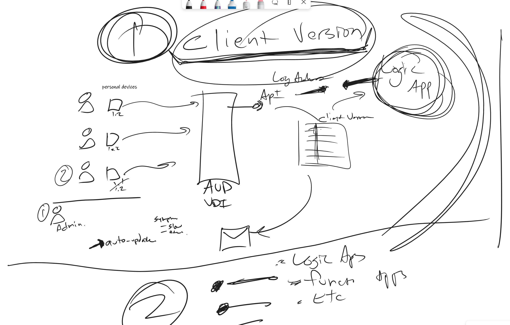
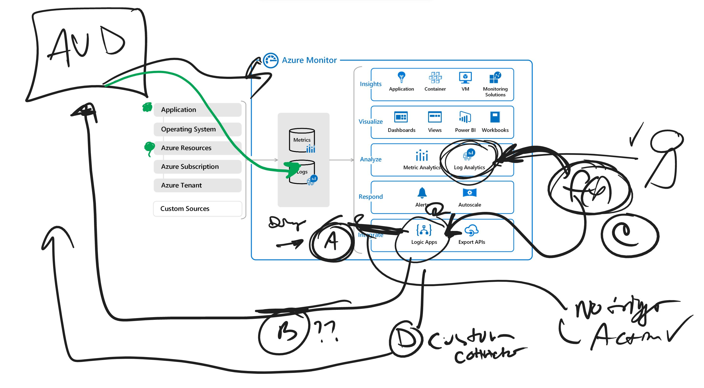

# Log Analytics Logic App with Email Demo
This project demonstrates how to email users based on data from log analytics using several Azure technologies:

- Log Analytics
- Logic Apps

Workflow:

- Simulate Clients Connecting to AVD Data
- Query Log Analytics
- Logic App will read Log Analytics Data and create an email



# Options



# Setup

- Core Infratructure
- Logic App

## Core infrastructure

Configure the variables.

```bash
# Global
export RG_NAME=avd_email_demo
export RG_REGION=westus
export STORAGE_ACCOUNT_NAME=avd_email_demo_sa

# Logic App variables
export LOGIC_APP_NAME=VirtualDesktopClientEmail
```

### Resource Group

Create a resource group for this project

```bash
az group create --name $RG_NAME --location $RG_REGION
```

### Logic App

Make a copy of `logic_app\definition-example.json` and rename to `logic_app\definition.json`. Edit the file with the necessary values.

```bash
# Deploy the logic app
az logic workflow create --definition /path_to_project/logic_app/definition.json
--location $RG_REGION
--name $LOGIC_APP_NAME
--resource-group $RG_NAME
```


# References